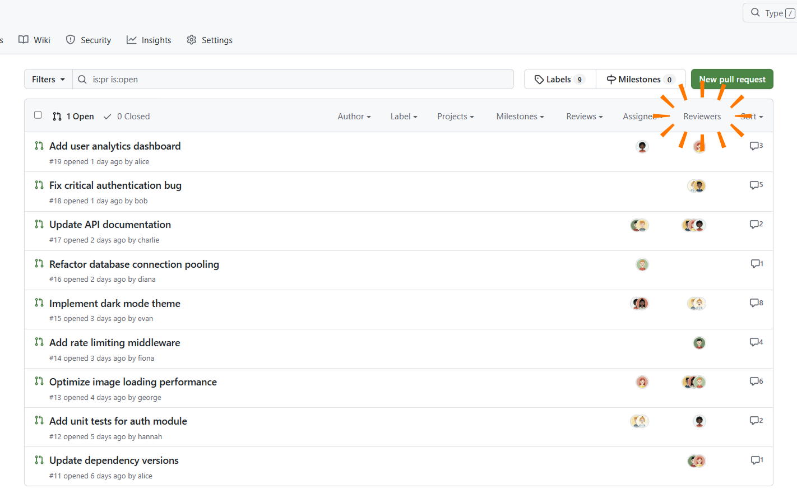

# Show PR Reviewers

A Chrome extension that displays requested reviewers on GitHub pull request list pages. Requires a GitHub Personal Access Token with `repo` scope.

> [!IMPORTANT]
> When using it for the first time, please reload the Github screen.

## Known Issues

## Release Notes

### 1.0.0

- Initial release

### Additional request

- [sahksas/show-pr-reviewers](https://github.com/sahksas/show-pr-reviewers)

If you have any bugs or requests, please send us a pull request directly or message us!

## Privacy Policy

- Your GitHub Personal Access Token is stored locally and used only for GitHub API requests.
- Reviewer data is cached locally for 5 minutes.
- No data is collected, sold, or shared with third parties.
